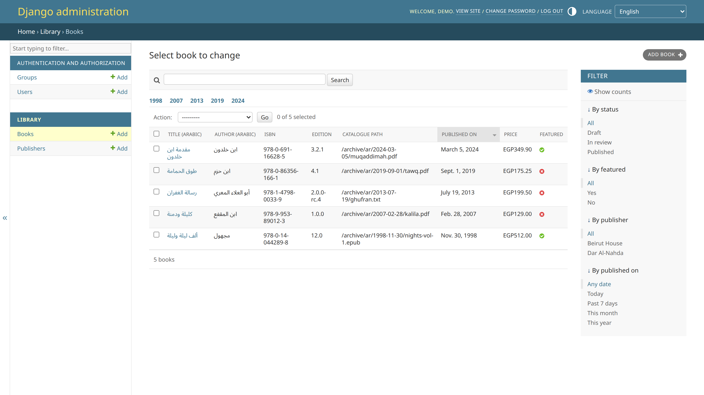
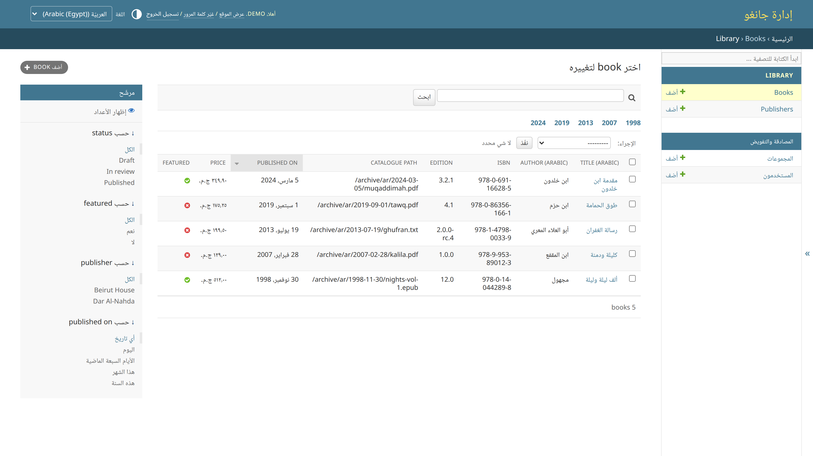

# django-rtl-admin

[](https://github.com/MarwanMaher0/django-rtl-admin/actions/workflows/ci.yml)
[](https://github.com/MarwanMaher0/django-rtl-admin)
[](https://www.djangoproject.com/)
[](LICENSE)

The Django admin is *nearly* bilingual. Switch it to Arabic, Hebrew, Persian or
Urdu and the page does flip — but a specific, repeatable set of things stays
pointing the wrong way, and any value that mixes scripts (an ISBN, an email, a
file path, a version string, a hyphenated date) is quietly reordered on screen.

`django-rtl-admin` fixes those things. It is one app you add to
`INSTALLED_APPS`; it does not replace the admin, restyle it, or ask you to
change your `ModelAdmin` classes.

| English | Arabic (Egypt) |
| --- | --- |
|  |  |

Same project, same `ModelAdmin`, one language switch. Note the Arabic-Indic
digits in the price column, the identifiers that stayed the right way round,
and the fact that the English side is byte-for-byte the stock admin plus a
language switcher.

---

## The problem, specifically

Django styles the admin with *physical* CSS properties (`margin-left`,
`padding-right`, `float: left`, `text-align: left`) and then ships a
hand-maintained `admin/css/rtl.css` that flips a subset of them back. Every rule
the mirror file misses is a visible defect. Measured with `getComputedStyle` on
Django 5.2, in an `ar-EG` admin:

1. **The "Add" button's `+` icon does not move.** `.object-tools a.addlink`
   computes `background-position: calc(100% - 7px) 50%; padding-right: 26px` —
   the icon stays on the leading edge instead of the trailing one. There is no
   rule for it in `rtl.css`.
2. **The object-tools buttons run in LTR order.** `.object-tools li` keeps
   `float: left; margin-left: 5px`.
3. **The action dropdown's gap is on the wrong side.**
   `#changelist .actions select` keeps `margin-left: 10px`.
4. **The date/time widget gets two margins at once.** `rtl.css` mirrors
   `.vDateField` but not `.datetime input`, and neither resets the other, so the
   field computes `margin-left: 5px` *and* `margin-right: 2px`.
5. **The sidebar's collapse chevron points the wrong way.** It is a literal
   `»`/`«` in a `content:` declaration, and `rtl.css` never swaps the pair, so
   once the sidebar moves to the other edge the arrow points away from it.
6. **Field help text is padded on both sides.** It keeps `padding-left: 10px`
   from `base.css` and gains `padding-right: 10px` from `rtl.css`.
7. **English labels render with the colon on the wrong side** — `:Title
   (Arabic)` instead of `Title (Arabic):` — because nothing in the admin is
   direction-aware at the text level.
8. **An English fieldset description gets its full stop at the *start* of the
   line**, for the same reason.
9. **A path typed into a text input is reordered.**
   `/archive/ar/2024-03-05/file.pdf` displays with the leading slash at the
   other end. The database is fine; the human reads the wrong string.
10. **Whole rules have no RTL counterpart at all:** `.colSM`,
    `.colSM #content-related`, `.colSM #content-main` (the sidebar-left column
    layout), `#content-related .actionlist li` (recent actions),
    `.related-lookup`, `.file-upload .deletelink`, `form div.radiolist div`,
    `.selector-chooseall`, `.selector-clearall`,
    `.selector .selector-filter label`, `.stacked`, `blockquote`, and
    `table thead th.sorted .sortoptions a.sortremove::after`.

And one more that is not a bug so much as a gap: **Django's l10n has no concept
of a numbering system.** `django.utils.formats.number_format` will never give
you `١٢٣٤` for `ar-EG`, no matter how you set `USE_THOUSAND_SEPARATOR`, because
CLDR numbering systems are simply not modelled.

---

## Install

```bash
pip install django-rtl-admin

# optional, for CLDR-accurate numbers, dates and currency:
pip install "django-rtl-admin[babel]"
```

Then put the app **above** `django.contrib.admin`, so its template overrides win:

```python
INSTALLED_APPS = [
    "django_rtl_admin",      # must come first
    "django.contrib.admin",
    ...
]
```

A system check (`rtl_admin.W001`) tells you if you get the order wrong.

For the language switcher you also need `LocaleMiddleware` and the `set_language`
view, which is the standard Django i18n setup:

```python
MIDDLEWARE = [
    "django.contrib.sessions.middleware.SessionMiddleware",
    "django.middleware.locale.LocaleMiddleware",   # <-- here
    "django.middleware.common.CommonMiddleware",
    ...
]

LANGUAGES = [("en", "English"), ("ar-eg", "Arabic (Egypt)")]
USE_I18N = True
```

```python
# urls.py
urlpatterns = [
    path("admin/", admin.site.urls),
    path("i18n/", include("django.conf.urls.i18n")),
]
```

Checks `rtl_admin.W003` and `rtl_admin.W004` flag both of those if they are
missing, and the switcher renders nothing rather than raising.

That is the whole installation. Everything below is optional.

---

## Quickstart

### Stop identifiers being reordered in the changelist

```python
from django.contrib import admin
from django_rtl_admin import BidiSafeAdminMixin


@admin.register(Book)
class BookAdmin(BidiSafeAdminMixin, admin.ModelAdmin):
    list_display = ("title_ar", "isbn", "edition", "catalogue_path", "published_on")
```

Every cell is now wrapped in a Unicode isolate. Column headers, sort links,
`column-<name>` CSS classes and the link to the change form are unchanged;
boolean columns (which render as icons) and anything in `list_editable` are left
alone.

### In your own templates

```django


{{ book.isbn|bidi_isolate }}              {# 978-0-262-03561-3, the right way round #}
{{ note|bidi_runs }}                      {# isolate only the embedded runs #}
{{ book.price|l10n_currency:"EGP" }}      {# ٣٤٩٫٩٠ ج.م.‏ in ar-EG, EGP349.90 in en #}
{{ book.published_on|l10n_date:"long" }}
<td dir="{{ value|bidi_dir }}">{{ value }}</td>
```

### In Python

```python
from django_rtl_admin import mark_isolated, format_currency, format_number

@admin.display(description="Reference")
def reference(self, obj):
    return mark_isolated(obj.reference)     # escaped first, then isolated

format_number(1234567.891, language="ar-eg")   # '١٬٢٣٤٬٥٦٧٫٨٩١'
format_currency("349.90", "EGP", language="ar-eg")
```

---

## What you get

### 1. Direction-aware admin styling

A template override (`admin/base_site.html`) and a stylesheet that restates the
admin's physical rules with **logical properties** — `margin-inline-start`,
`padding-inline-end`, `inset-inline-start`, `text-align: start`,
`float: inline-end`. Logical properties are correct in both directions by
construction, so the same rules that flip an Arabic admin are no-ops in an
English one. Nothing is duplicated per direction except the handful of things
that genuinely are directional: sprite offsets, mirrored icons, chevrons.

It covers the sidebar, the changelist, the filter column, the object-tools bar,
the action bar, the paginator, aligned forms, inlines, the date/time widgets,
the many-to-many selector, select2 autocompletes and the login page — the places
where stock RTL support runs out.

The stylesheet is linked from the `responsive` block of `admin/base.html`, which
is the last stylesheet hook there is, so it wins over both
`admin/css/rtl.css` and `admin/css/responsive_rtl.css`.

Two CSS-level safety nets come with it, both opt-out:

- `unicode-bidi: isolate` on changelist cells, so one mixed-direction value
  cannot drag its neighbours around inside a row;
- `unicode-bidi: plaintext` on text inputs, textareas, labels, help text and
  read-only values — the CSS equivalent of `dir="auto"`. Each field picks its
  own direction from what was actually typed into it, which is what a bilingual
  data-entry form needs.

### 2. Bidirectional text safety

The Unicode Bidirectional Algorithm reorders text at display time. That is
right for prose and wrong for identifiers. The fix is Unicode *isolates* —
U+2066 LRI, U+2067 RLI, U+2068 FSI, terminated by U+2069 PDI — which are plain
characters, not markup, so they survive escaping, copy-and-paste, `json.dumps`
and database round-trips.

```python
>>> from django_rtl_admin import isolate, isolate_runs, mark_isolated
>>> isolate("v1.2.3")
'⁨v1.2.3⁩'
>>> isolate_runs("مرحبا /srv/archive/report.pdf", base="rtl")
'مرحبا ⁦/srv/archive/report.pdf⁩'
>>> mark_isolated("<script>alert(1)</script>")     # escapes, then isolates
'⁨&lt;script&gt;alert(1)&lt;/script&gt;⁩'
```

`mark_isolated()` escapes before it wraps, and `mark_isolated_runs()` isolates
the raw text before escaping so that an isolate character can never land inside
an HTML entity. Values already marked safe are honoured exactly as
`conditional_escape` honours them.

`isolate_runs()` is the smarter of the two: it walks the string and wraps only
the parts the algorithm would actually reorder — Latin words inside Arabic
prose, and, in an RTL paragraph, punctuated numeric runs such as `2024-03-05`,
`1.2.3` or `10:45:02`. A bare `1234` is left alone, because it renders
correctly on its own. Punctuation glued to a run travels with it (the leading
slash of a path is exactly the character that jumps otherwise); punctuation
separated by a space stays with the surrounding sentence.

### 3. Locale-aware formatting

Arabic locales do not agree on how to write a number. `ar-EG` uses Arabic-Indic
digits with U+066C as the group separator and U+066B as the decimal separator;
`ar-MA` and plain `ar` use Latin digits with the usual comma and full stop. CLDR
knows this; Django does not model it at all.

```python
>>> from django_rtl_admin import format_number, numbering_system
>>> numbering_system("ar-eg"), numbering_system("ar"), numbering_system("fa")
('arab', 'latn', 'arabext')
>>> format_number(1234567.891, language="ar-eg")
'١٬٢٣٤٬٥٦٧٫٨٩١'
>>> format_number(1234567.891, language="en")
'1,234,567.891'
```

[Babel](https://babel.pocoo.org/) is used when it is installed and falls back to
`django.utils.formats` plus a digit transliteration step when it is not —
`pip install django-rtl-admin[babel]` if you want CLDR patterns, but nothing
here raises without it.

### 4. A language switcher

Rendered into the admin header (and onto the login page), listing
`settings.LANGUAGES`, posting to `set_language`, preserving the current admin
URL through `next`. It is a plain `<select>` and a submit button, so it works
with JavaScript disabled; a small deferred script hides the button and submits
on change when JavaScript is available. No inline scripts, no inline styles, no
CDN.

It renders nothing — silently, no exception — when it is switched off, when
fewer than two languages are configured, or when `set_language` is not routed.

---

## Settings

Everything lives in one dict. Every key is optional; every feature is opt-out.

```python
RTL_ADMIN = {
    "CURRENCY": "EGP",
    "LANGUAGE_SWITCHER_LABELS": "both",
}
```

| Key | Default | What it does |
| --- | --- | --- |
| `ENABLE_CSS` | `True` | Link the direction-aware stylesheet into the admin `<head>`. |
| `FONT_STACK` | `None` | Override the `--rtl-admin-font-stack` custom property. A string or a sequence of family names. |
| `EXTRA_RTL_LANGUAGES` | `()` | Language codes to treat as RTL on top of the ones Django already knows about. |
| `ISOLATION_DIRECTION` | `"auto"` | Default isolate used by `bidi_isolate` and the mixin: `"auto"` (FSI), `"ltr"` (LRI) or `"rtl"` (RLI). |
| `ISOLATE_CHANGELIST` | `True` | Let `BidiSafeAdminMixin` isolate changelist cells. |
| `ISOLATE_TABLE_CELLS` | `True` | CSS-level `unicode-bidi: isolate` on changelist cells. |
| `PLAINTEXT_FORM_FIELDS` | `True` | CSS-level `unicode-bidi: plaintext` on text inputs and textareas. |
| `NUMERALS` | `"auto"` | Numbering system for the formatting helpers: `"auto"` follows the locale, or force `"latn"`, `"arab"` or `"arabext"`. |
| `USE_BABEL` | `True` | Use Babel when it is installed. `False` always uses Django's own l10n. |
| `CURRENCY` | `"USD"` | Default currency for `format_currency` / `l10n_currency`. |
| `LANGUAGE_SWITCHER` | `True` | Render the switcher in the admin header. |
| `LANGUAGE_SWITCHER_LANGUAGES` | `None` | `None` means `settings.LANGUAGES`; otherwise a sequence of codes or `(code, label)` pairs. |
| `LANGUAGE_SWITCHER_LABELS` | `"native"` | `"native"` (العربيّة), `"translated"` (Arabic) or `"both"`. |

An unknown key is reported by system check `rtl_admin.W002` rather than ignored,
and an invalid choice raises `ImproperlyConfigured` at the point of use.

---

## Reference

### Template filters — ``

| Filter | Example | Notes |
| --- | --- | --- |
| `bidi_isolate` | `{{ v\|bidi_isolate }}`, `{{ v\|bidi_isolate:"ltr" }}` | Wrap the whole value in an isolate. Escapes first; honours ``. |
| `bidi_runs` | `{{ note\|bidi_runs }}`, `{{ note\|bidi_runs:"rtl" }}` | Isolate only the embedded opposite-direction runs. |
| `bidi_strip` | `{{ v\|bidi_strip }}` | Remove every isolate and directional mark. |
| `bidi_dir` | `<td dir="{{ v\|bidi_dir }}">` | First-strong direction of the value: `"rtl"` or `"ltr"`. |
| `l10n_number` | `{{ n\|l10n_number }}`, `{{ n\|l10n_number:"2" }}` | Locale-aware number in the locale's numbering system. |
| `l10n_currency` | `{{ p\|l10n_currency:"EGP" }}` | Locale-aware money; the argument is optional. |
| `l10n_percent` | `{{ ratio\|l10n_percent }}` | A 0..1 ratio as a percentage. |
| `l10n_date` | `{{ d\|l10n_date:"long" }}` | `short`, `medium`, `long`, `full`. |
| `l10n_datetime` | `{{ dt\|l10n_datetime }}` | |
| `l10n_time` | `{{ t\|l10n_time }}` | |
| `local_digits` | `{{ "REF-2024"\|local_digits }}` | Rewrite digits in a ready-made string. |

### Template tags

| Tag | Returns |
| --- | --- |
| `` | `"rtl"` or `"ltr"` for the active language. |
| `` | The `rtl-admin …` class list the stylesheet keys off. |
| `` | The stylesheet `<link>` plus any `FONT_STACK` override. |
| `` | The deferred `<script>` for the switcher. |
| `` | The switcher form. |
| `` | The switcher's languages as plain data, for custom markup. |
| `` | Join values, isolating each. |
| `` | `h1` or `div`, whichever the running Django's admin CSS expects. |

### Python API

```python
from django_rtl_admin import (
    BidiSafeAdminMixin,
    LRI, RLI, FSI, PDI,
    isolate, isolate_runs, strip_isolates, is_isolated,
    mark_isolated, mark_isolated_runs,
    text_direction, has_mixed_direction, is_rtl_language, current_direction,
    numbering_system, transliterate_digits,
    format_number, format_currency, format_percent,
    format_date, format_datetime, format_time,
    rtl_settings,
)
```

### `BidiSafeAdminMixin`

| Attribute | Default | What it does |
| --- | --- | --- |
| `bidi_isolate_changelist` | `None` | `True`/`False` overrides `RTL_ADMIN["ISOLATE_CHANGELIST"]` for this admin. |
| `bidi_isolate_fields` | `None` | Restrict isolation to these `list_display` entries. |
| `bidi_isolate_exclude` | `()` | Leave these entries alone. |
| `bidi_isolation_direction` | `None` | `"auto"`, `"ltr"` or `"rtl"` for this admin. |

### System checks

| ID | Meaning |
| --- | --- |
| `rtl_admin.W001` | `django_rtl_admin` is listed after `django.contrib.admin`, so the template overrides will not apply. |
| `rtl_admin.W002` | `RTL_ADMIN` contains keys this app does not understand. |
| `rtl_admin.W003` | The switcher is on but `set_language` cannot be reversed. |
| `rtl_admin.W004` | `LocaleMiddleware` is not installed, so a chosen language will not stick. |

---

## Keeping your own `admin/base_site.html`

The app ships `admin/base_site.html`, which does nothing but extend
`django_rtl_admin/base_site.html`. If your project needs its own, extend the
latter and you keep everything:

```django



  <div id="site-name">Acme</div>

```

---

## Browser support

The stylesheet uses CSS logical properties (`margin-inline-start`,
`inset-inline-end`, `float: inline-start`), `unicode-bidi: plaintext` and
`color-mix()`. All are available in Chrome/Edge 118+, Firefox 115+ and
Safari 16.2+. Older browsers fall back to Django's own `rtl.css`, which is what
they would have had anyway.

---

## The example project

```bash
git clone https://github.com/MarwanMaher0/django-rtl-admin
cd django-rtl-admin
pip install -e ".[babel]"

cd example
python manage.py migrate
python manage.py demodata        # creates the superuser and sample records
python manage.py runserver
```

Then open <http://127.0.0.1:8000/admin/> and log in as `demo` / `demo12345`.
The library app has a model with parallel English and Arabic fields, an inline,
an autocomplete, a date hierarchy, filters and the sorts of values that break
under bidi. Use the switcher in the header to flip between English, Arabic,
Arabic (Egypt) and Hebrew; `ar` and `ar-eg` differ only in their numbering
system, which is the point.

---

## Tests

```bash
pip install -e ".[test]"
pytest
ruff check .
```

The suite covers the isolation helpers across many input shapes, autoescape
correctness (HTML in a value must stay escaped, in Python and through the
changelist), filter and tag registration, numbering-system formatting with and
without Babel, the mixin applied to a real changelist, the language switcher,
the settings namespace, the system checks, and the fact that the template
overrides resolve ahead of `django.contrib.admin`.

CI runs Python 3.10 and 3.12 against Django 4.2 and 5.2.

---

## Licence

MIT. See [LICENSE](LICENSE).
